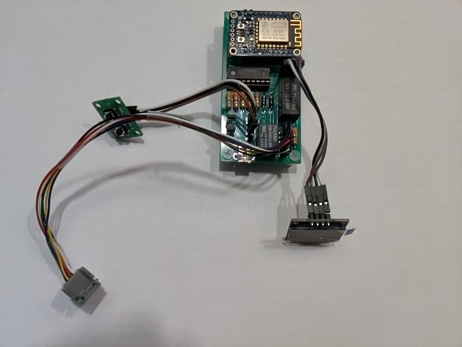
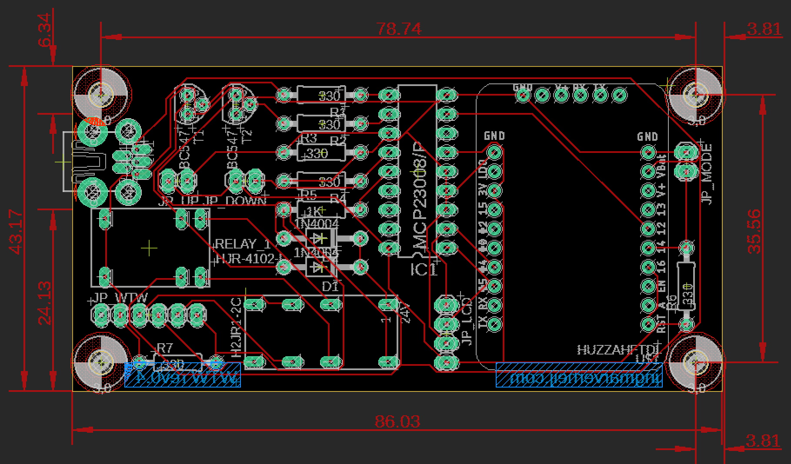

# RenoventHR

All rights of the Mechenical ventelation system are owned by Renovent.

This is a reverse engeneered control device to remotely control and automate ventilation at home.

**Usage of this project is on your own risk.**

# Results

Some screenshot of the final endresult


Bottom view case


Side view case


Bottom view case

# Motivation

Connected RenoventHR Module to switch a mechanical ventilation heat recovery system from Renovent HR.



I was first inspired by a friend whom wanted to switch his mechanical ventilation. He has a Renovent setup and he could use a RF solution.
That started me thinking let’s try this myself, off course I have a different setup that’s a little more complicated because of the heat recovery.

After an evening of googling I found a site of an old classmate (what a small world) Ingmar Verheij. His journey is the same as mine, but he already solved it (https://www.ingmarverheij.com/bediening-wtw-altijd-op-de-verkeerde-plek/).

He posted a solution on git but did not finish a tutorial, so I thought I could solve this quickly. After approximately half a year I can say I finished reverse engineering the setup and build the whole project with a 3D printed case (still in backorder).

I refactored the code (separated code, minified web and altered some functionality so the interaction should work) to my taste and added a few configuration hacks. 
Changes made were approximately:
 - Minified HTML (minimize System footprint)
 - Further restructured and optimized code
 - Added manual config (personal taste)
 - Separated Core, Data, Interfacing and tools (not fully)
 - Removed intmode/pinmode (secondary in total)
 - Added/rebuild button, startup, filter functions
 - Restructured code
 - Changed MCP calls intMode to pinMode
 - Added manual WIFI configuration trough config file


Also, the reverse engineering of the electronics created a lot of issues. The original part list provided left out crucial info for the relays. I almost stopped because I couldn’t fix it, after measuring everything and re-checking (going back in the books) I discovered that the pictures of the relays on the site were not the correct voltage. The part list in the bottom are all the correct parts. Be careful with the rj12 jack, if you use a different form factor it maybe will not fit in the case (adjust the case according with fusion 360).

So, to let you wait further let’s go into the build.

# Building the code
The code needs to be compiled with preferably the Arduino IDE version 2.4.1 below the settings:

 
Set the compiler to use the right version 2.4.1 of nodemcu ESP firmware build tools. 

 
Set the correct settings for the HUZZAH board for uploading the compiled code.

I also added the working libraries, after a lot of juggling I figured these are the used standard libs:
https://github.com/RoyOltmans/RenoventHR/tree/master/lib

For flashing the HUZZAH via a normal usb cable use the correct sequence of buttons to get in program mode. If I remember correctly, GPIO0 must be low while booting: press and hold the reset button. press and hold the program button. release the reset button, the HUZZAH will boot in program mode.

# Case
 To build the case use the following STL files in this location https://github.com/RoyOltmans/RenoventHR/tree/master/bin/3D%20Models%20STL

I have also added the Fusion 360 (from autodesk https://www.autodesk.com/products/fusion-360/students-teachers-educators) file so you can edit the case (please do not judge my CAD skills).

You will need to get a DIN rail to mount the case on and if you prefer as I do a 5-volt din rail power source. 


See Mean Well DR-15-5 DIN-rail 5 V/DC2.4A 12W (https://s.click.aliexpress.com/e/mliRreY0)

# PCB's
To build the project firstly you need to order the PCB design via for example seeed studio, they can process eagle schema (in the repository).


The primary pcb:
https://github.com/RoyOltmans/RenoventHR/tree/master/pcb/EAGLE/RenoventHR%20v0.4

I ordered this board on https://www.seeedstudio.com/ was very happy with end result and the price.
To edit the board you will need Eagle (from autodesk https://www.autodesk.com/products/eagle/free-download) you can download this freely.


The double switch pcb:
https://github.com/RoyOltmans/RenoventHR/tree/master/pcb/Fritzing/Double%20Tactile%20Switch%20v0.3

I ordered this board directly via the tool, also very good service, price and quick (https://aisler.net/partners/fritzing).
To edit this board you will need fritzing you can download this for free (https://fritzing.org/home/).

# Pinlayout

Every connector PCB printed text should be horizontally aligned to number the pins, pin 1 itterating every pin plus 1 afterwards are the pin numbers.

LCD pinlayout
```
-----------------
JP_LCD PINS
Pin   1   2   3   4
      |   |   |   |
Pin  VCC GND SCL SDA
Connected to LCD 
-----------------
```
Switch Pinlayout
```
-----------------
JP_UP PINS:

Pin    1         2 
       |         |
Pin    -     Left Pin
JP_1 on DBL SW PCB
-----------------
JP_DOWN PINS
Pin    1         2 
       |         |
Pin Center Pin  Right Pin
JP_1 on DBL SW PCB
-----------------
```

WTW RJ12 connector
```
-----------------
JP_WTW PINS
  1     2    3    4      5    6
  |     |    |    |      |    |
White Black Red Green Yellow Blue
RJ12 Color coding
-----------------
```

# Tools
Personally, I solder with a soldering tip Pencil shape size 0.4 mm, this worked perfectly. 

Good tools are half of the work, new tip, good soldering paste (wire), magnifying glass etc.

# SMART-HUB - Home Assistant
For details on connecting to the HA, I suggest looking at the site of Ingmar https://www.ingmarverheij.com/built-smart-heat-recovery-system/

Be careful I changed the MQTT paths and these are accessible via the config file. I will repost them below:
```
/*-------------------MQTT topics-------------------*/
#define Gateway_Name "RenoventHR"
#define Base_Topic "home/"
#define MQTT_GetState_Topic Base_Topic Gateway_Name "/getWTWstate"
#define MQTT_State_Topic Base_Topic Gateway_Name "/wtwState"
#define MQTT_FilterState_Topic Base_Topic Gateway_Name "/changeFilter"
#define MQTT_SetState_Topic Base_Topic Gateway_Name "/setWTWstate"

#define MQTT_Standard_Topic Base_Topic Gateway_Name
```

After some tinkering I have decided to add a short totorial of the implementation in Home Assistant. Notice you will MQTT to get this fully operational.

I am using a older version of **HA version 0.86.4**. *Be aware this can work differently on your version of HA.*

Firstly you will need to upload a javascript in to the `www` folder of the configuration root of home-assistant (your .yaml are also located here). If this folder does not exist create it. 

On linux you can do the following steps:
```
mkdir www
wget https://raw.githubusercontent.com/RoyOltmans/RenoventHR/master/code/Home%20Assistant/www/fan-control-entity-row.js
```

After you have done this on older version of HA you need to edit ui-lovelace.yaml (this does not work if you created a lovelace interactive version.

In ui-lovelace.yaml you will need to add the following below `resources`                                                                 ```
  - url: /local/fan-control-entity-row.js                                                                                                   type: js
```

If this does not work you can try to open the raw editor of lovelace and add the following at the top: 
```
resources:
  - type: js
    url: /local/fan-control-entity-row.js
```

Once your finished add a new file to the configuration root of home assistant. Use the follwoing command for that
```
wget https://raw.githubusercontent.com/RoyOltmans/RenoventHR/master/code/Home%20Assistant/fan.yaml
```

Onze you have done all these staps restart home assistant fully, this will reload and add the fan control of the WTW via MQTT.

Onze you have finished this you can add the following card to your lovelace dashboad. You can do this by toggling the editor and adding a card manualy.

```
entities:
  - customTheme: true
    entity: fan.wtw_mechanic_ventilation
    name: WTW Renovent HR
    type: 'custom:fan-control-entity-row'
    show_header_toggle: false
title: Mechinical Ventilation
type: entities
```

Once started you will enter a 
# Configuration and Software
For configurations, you can follow the description on https://www.ingmarverheij.com/built-smart-heat-recovery-system/
The software as written by Ingmar is still operational, you can interact directly with the device. Or you can couple it through a smart hub via MQTT as described above.

Or edit the config.h file adding your personal configurations, below you will find the details of the config.h:
```
/*-------------------General----------------------*/
const char* Version = "0.5";

/*-------------------WIFI Settings----------------*/
String APssid = "SSID WIFI";
String APpassword = "PASSWORD WIFI";

/*-------------------MQTT Settings-------------------*/
String mqtt_user = "your_username"; // not compulsory only if your broker needs authentication
String mqtt_pass = "your_password"; // not compulsory only if your broker needs authentication
String mqtt_server = "MQTT SERVER NAME or IP";
long mqtt_port = strtol("1883",NULL,10);

/*-------------------MQTT topics-------------------*/
#define Gateway_Name "RenoventHR"
#define Base_Topic "home/"
#define MQTT_GetState_Topic Base_Topic Gateway_Name "/getWTWstate"
#define MQTT_State_Topic Base_Topic Gateway_Name "/wtwState"
#define MQTT_FilterState_Topic Base_Topic Gateway_Name "/changeFilter"
#define MQTT_SetState_Topic Base_Topic Gateway_Name "/setWTWstate"

#define MQTT_Standard_Topic Base_Topic Gateway_Name
```

# Part list

-  1x Miniature relay HJR-4102-L-05VDC-S-Z (order at Conrad (EU))
-  1x Miniature relay HJR1-2C-L-05VDC (order at Conrad (EU))
-  1x IC base 18 pins (order at Conrad (EU))
-  1x Jumper black open (Jumper zwart open) (order at Conrad (EU))
-  6x Carbon film resistance 0,5W 0411 330Ohm (Koolfilmweerstand 330Ω Axiaal bedraad 0411 0.5 W 5) (order at Conrad (EU))
-  1x Carbon film resistance 0,5W 0411 1KOhm (Koolfilmweerstand 1 kΩ Axiaal bedraad 0411 0.5 W 5 ) (order at Conrad (EU))
-  1x Bus, horizontal installation MUB1B5W 1 Port econ connect (order at Conrad (EU))
- 1x Würth Elektronik Male header (order at Conrad (EU))
- 1x Würth Elektronik Female header (standard) WR-PHD Total poles 10 grid size: 2.54 mm 61301011821 (order at Conrad (EU))
- 1x Microchip Technology MCP23008-E/P Interface-IC - I/O expansion POR I²C 1.7 MHz PDIP-18 (order at Conrad (EU))
-  2x Diotec BC547A Transistor (BJT) - discreet TO-92 1 NPN (order at Conrad (EU))
-  2x Diotec Si-rectifier diode 1N4004 DO-204AL 400 V 1 A (order at Conrad (EU))
- 1x Adafruit HUZZAH ESP8266 Breakout (https://www.adafruit.com/product/2471)
-  1x rj12 jack with cables and sleeve for case (https://s.click.aliexpress.com/e/ExAocZHe)
-  1x 0.96inch 128X64 Yellow Blue OLED Display Module (https://s.click.aliexpress.com/e/39m65cSM)
-  Dupont Wire Jumper Pin Header Connector (https://s.click.aliexpress.com/e/3WbYzW3I)
- Dupont Wires (https://s.click.aliexpress.com/e/KMFFxgfe)
-  A generic pushbutton (https://s.click.aliexpress.com/e/kaTmlRJw)
